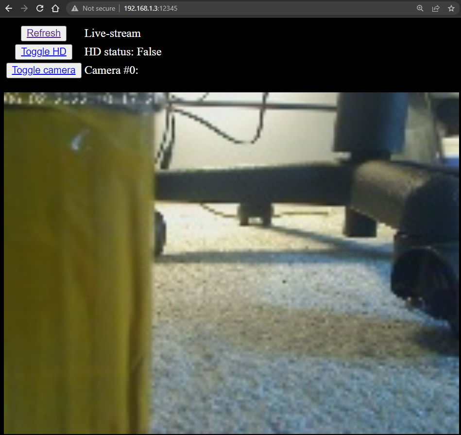
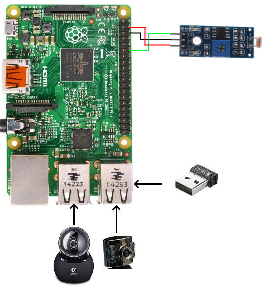

# Raspberry-pi Security Cam

# Overview
Using a raspberry pi and 2 USB webcams, this project aims to both record, and display a live image of the feed on a local http server. This program is run on a raspberry pi (or other computer) which can be placed in a convienient location for the user. For me, this was to monitor the inside and outside of a chicken coop, but it can be modified for whatever you want. 

# Hardware
- Raspberry PI 2B
- Logitech QuickCam Orbit MP USB Webcam (Camera 1)
- Unbranded automatic IR USB webcam (Camera 2)
- Arduino/Raspberry LDR module (need at least pins VCC, GND, D0)
- USB Wifi Dongle (if WIFI is not already built-in)

# Methodology
Utilizing pygame camera module, this program connects to 2 USB webcams that are plugged into the raspberry pi. 1 thread is launched per camera, and only 1 camera is read at a time using threadlocks. I found that if this is not done then sometimes the USB webcams disconnect. For my configuration, the reason for the LDR module above is because camera 1 is located outside, so we dont want to record when it is dark out. Camera 2 is inside with an IR sensor, so it will record regardless. Edit the code if you want the configuration differently. Each photo taken is stored in RAM, and then after a set amount of time **time_cycle** the video(s) are written. In another thread (write_video), using opencv videowriter, the video is written to disk in a day-separated folder. If the folder count is more than days_recorded, delete the old ones to free up space. In yet another thread, a http server is running. This is just a simple part using python TCP threads for the lowest latency rather than using something like django or flask. I did try using flask, but with the 2B's limited memory and CPU it was not running properly. There are 3 buttons on this simple website, "refresh", "toggle hd", and "toggle camera". All are pretty self-explanatory. Below these, the a screenshot is displayed.  

# Installation

This program will require a RPI or similar host computer. This project requires a wifi beacon to run the http server on (or not, if you only want to record then comment out the http server code) This project requires [Python](https://www.python.org/downloads/) to run, and the following plugins:

- [OpenCV](https://opencv.org/)
- [pygame](https://www.pygame.org/news)

# Wiring
See the image below to see how this was wired. For the LDR module (if youre having one camera outside), connect GPIO pin 18 to the D0. Connect VCC to VCC and GND to GND on the raspberry pi. Then, just connect your two webcams to the USB. You may have to flip them if you find that they are displaying in the wrong order. Again though, if this is not the configuration you desire feel free to modify the code. 

# Usage

## Pre-configuration

Be sure to set all configurable variables before running or youll get errors. These are located right under the "configurations" comment in the code. 

## HTTP website

Press the refresh button to refresh the page. Upon pressing the other 2 buttons, you must first press the button and then press refresh after a second to get the refreshed feed.
